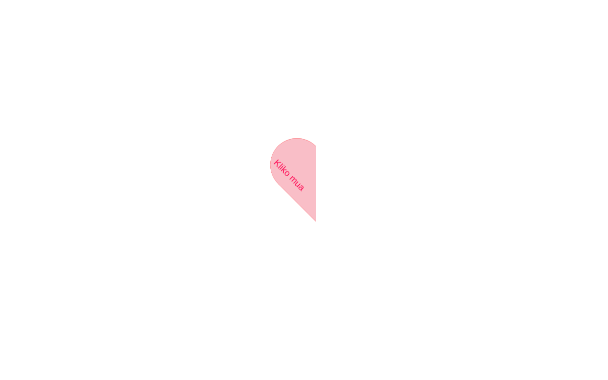

# 💌 Të Dua — Kartë e animuar

Një kartë e vogël e animuar "Të dua" — kliko zemrën dhe ajo hapet me animacion 3D, konfeti, sfond gradient dhe muzikë. E përshtatur plotësisht në shqip.

**Live demo:** https://erionnezha.github.io/I-Love-You-Card/

## Si ta hapësh lokalisht

1. Shkarko ose klono këtë repo.
2. Hap `index.html` në shfletuesin tënd — nuk nevojitet server apo ndërtim.
3. Kliko zemrën për ta hapur kartën (dhe kliko sërish për ta mbyllur).

## Teknologjitë

- HTML, CSS, JavaScript (pa framework)
- [highlight.js](https://highlightjs.org/) — ngjyrosja e kodit në kartë
- [Granim.js](https://sarcadass.github.io/granim.js/) — sfondi me gradient të animuar

## Licenca

MIT — shih [LICENSE](LICENSE).

---

# 💌 I Love You — Animated Card

A small animated "I love you" card — click the heart and it opens with a 3D animation, confetti, an animated gradient background and music. Fully localized in Albanian.

**Live demo:** https://erionnezha.github.io/I-Love-You-Card/

## Run locally

1. Download or clone this repo.
2. Open `index.html` in your browser — no server or build step needed.
3. Click the heart to open the card (click again to close it).

## Tech

- HTML, CSS, JavaScript (no framework)
- [highlight.js](https://highlightjs.org/) — code highlighting on the card
- [Granim.js](https://sarcadass.github.io/granim.js/) — animated gradient background

## License

MIT — see [LICENSE](LICENSE).
